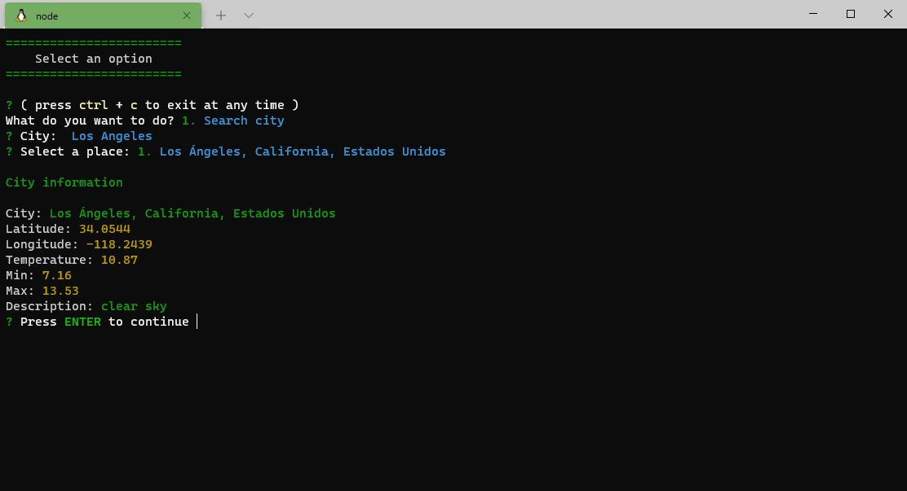

# Weather node app

This is a project built in Node.js isung some external packages, such as inquirer, colors, axios, creating an app that returns the temperature of a place acording to the geographic location ( latitude and longitude ).

## Table of contents

- [Overview](#overview)
  - [The project](#the-project)
  - [Screenshot](#screenshot)
  - [Links](#links)
- [My process](#my-process)
  - [Built with](#built-with)
  - [What I learned](#what-i-learned)
  - [Useful resources](#useful-resources)
- [Author](#author)

## Overview

### The project

Users should be able to:

- Search a place and get the temperature
- Check the search history

### Screenshot

### Links

- Solution URL: [Solution URL here](https://github.com/ncondes/weather-node-app)

## My process

### Built with

- Node.js
- Axios

### What I learned and put into practice

- Node.js
- OOP
- Axios
- inquirer

### Useful resources

- [Inquirer](https://github.com/SBoudrias/Inquirer.js#readme) - Inquirer Documentation.
- [Axios](https://github.com/axios/axios#readme) - Axios Documentation.
- [Node](https://nodejs.org/en/docs/) - Node.js Documentation.

## Author

- Website - [Nicolas Conde Salazar](https://www.ncondes.com)
- Linkedin - [Nicolas Conde Salazar](https://www.linkedin.com/in/ncondes/)
